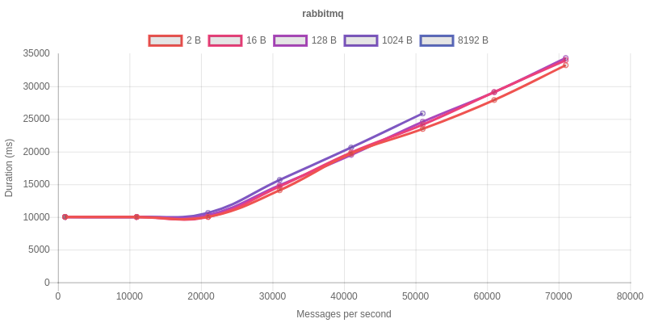
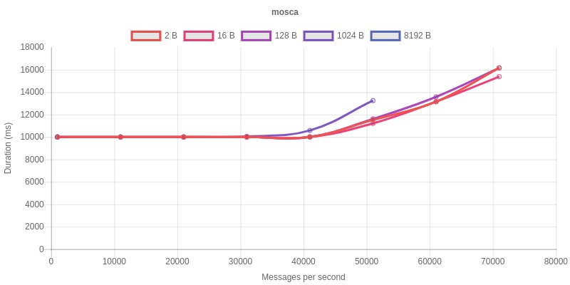
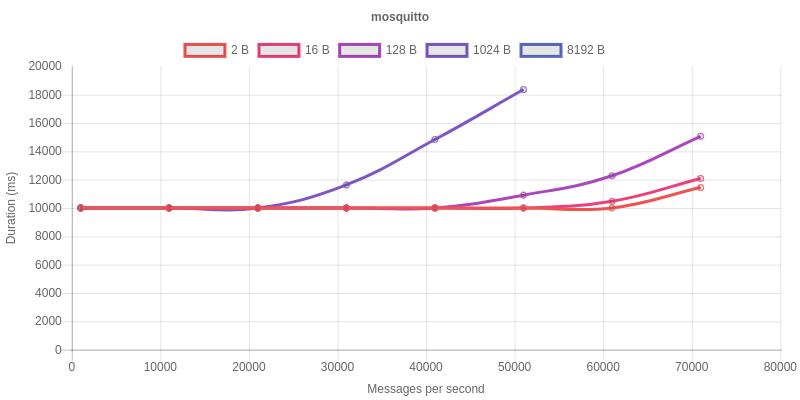
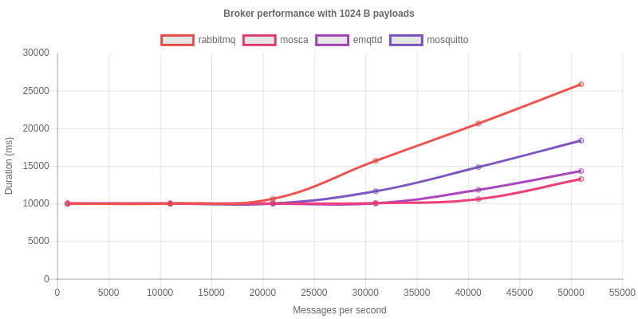

# MQTT Broker Benchmark

This projects implements a *simple* benchmark for multiple open source MQTT brokers.

The following brokers were considered to be included in the benchmark:

| Name            | Link                                        | Stars | Contributors |
|-----------------|---------------------------------------------|-------|--------------|
| RabbitMQ        | https://github.com/rabbitmq/rabbitmq-server | 4001  | 71           |
| emqttd          | https://github.com/emqtt/emqttd             | 2961  | 27           |
| mosca           | https://github.com/mcollina/mosca           | 2289  | 55           |
| mosquitto       | https://github.com/eclipse/mosquitto        | 1516  | 31           |
| VerneMQ         | https://github.com/erlio/vernemq            | 1246  | 16           |
| emitter         | https://github.com/emitter-io/emitter       | 1153  | 6            |
| Apache ActiveMQ | https://github.com/apache/activemq          | 1104  | 68           |
| moquette        | https://github.com/andsel/moquette          | 870   | 26           |
| HBMQTT          | https://github.com/beerfactory/hbmqtt       | 310   | 22           |
| MQTTnet         | https://github.com/chkr1011/MQTTnet         | 260   | 10           |
| Apache Apollo   | https://github.com/apache/activemq-apollo   | 107   | 10           |
| GnatMQ          | https://github.com/gnatmq/gnatmq            | 91    | 7            |
| RSMB            | https://github.com/MichalFoksa/rsmb         | 31    | 3            |
| Mongoose        | https://github.com/mongoose-os-libs/mqtt    | 7     | 3            |
| Trafero Tstack  | https://github.com/trafero/tstack           | 3     | 1            |
| JoramMQ         | https://gitlab.ow2.org/joram/joram          | 1     | 1            |

As a first step it was decided to only include the 4 most popular projects, using GitHub
stars as a metric for popularity. The numbers in the above table were recorded on 2018-05-04.
The selection is based on this list: https://github.com/mqtt/mqtt.github.io/wiki/server-support

New brokers can be added easily by providing a service configuration inside [`docker-compose.yml`](docker-compose.yml).

## Usage

### Locally

Run the benchmark on your local machine.

**Prerequisites**:
* [Docker](https://www.docker.com/)
* [Docker Compose](https://docs.docker.com/compose/overview/)

Export the name of the broker you want to test. E.g.:

    export MQTT_HOST=rabbitmq

Then start up the broker using:

    docker-compose up -d ${MQTT_HOST}

Now you can run the publisher to send data:

    docker-compose run --rm publisher

The results will be recorded into `results/results.json`. To view this file you can start up a webserver by executing `docker-compose up -d nginx`. The results will then be available at `http://localhost?live`.

You can omit `?live` to view the data inside the `results/BROKER_results.json` files.

### Ansible (on AWS)

You can also use the included Ansible playbook to provision EC2
instances and run the benchmark for all supported brokers automatically.

**Prerequisites**:
* [Ansible](https://www.ansible.com/)
* [Python Boto](https://github.com/boto/boto)
* AWS IAM user with EC2 access

`cd` into the `ansible` directory.

First you have to install dependencies:

    ansible-galaxy install -r requirements.yaml

Create a file called `hosts` with the following contents to specify AWS credentials:

    localhost   ansible_connection=local   aws_access_key=XXX   aws_secret_key=XXX

Then you can execute the playbook:

    ansible-playbook -i hosts playbook.yaml

The Ansible playbook will automatically create two `m4.large` instances and install docker.
One is used for the broker and one for the publisher.

The playbook will now clone this repository on the instances and execute the specified tests 
sequentially for each broker. This can take quite a long time.

To check up on the current status of the test you can have a look at the live data by going to
`http://${PUBLISHER_IP}?live`.

The results for each broker will be copied back to your machine into the `results` directory.

You can view them using `index.html` (see above).

## Design

To be able to easily provision and reproducibly execute the benchmark the 
brokers as well as the publisher are executed within Docker containers. 

Brokers are only tested using their default configuration. Whenever possible an existing,
official Docker image is used.

The publisher is written in JavaScript to be run using [Node.js](https://nodejs.org).
It utilizes the [MQTT.js](https://github.com/mqttjs/MQTT.js) client library.

This benchmark currently only tests [QoS level 0](https://github.com/mqttjs/MQTT.js/#qos).

The publisher can be adjusted to execute test cases with increasing payload size and an increasing number of messages per second.

By default the total theoretical throughput per second is restricted to 50 MiB to exclude extremely data intensive test cases.

Each test case will be run for 10 seconds. The amount of time until all messages are successfully sent to the broker is recorded.

See the beginning of [`publisher.js`](publisher.js) for details.

The payload consists of random bytes, generated with [`crypto.randomBytes`](https://nodejs.org/api/crypto.html) beforehand.

## Results

The interactive charts can be viewed at: https://lukaskorte.github.io/mqtt-broker-benchmark/

The following results were created using two [`m4.large`](https://aws.amazon.com/de/ec2/instance-types/) (2 vCPU, 8 GiB memory) EC2 instances on AWS.

### RabbitMQ

The results show that RabbitMQ slows down soon after receiving more than 20,000 messages per second, regardles of the payload size. When being hit with 71,000 messages per second it is almost 3.5 times slower compared to a low message count.

### emqttd

Emqttd's results stay consistent until around 30,000 messages per second. The worst execution time is only about 1.5 times slower compared to a low message count

### mosca

Mosca shows very similar results to emqttd:

### mosquitto

Mosquitto's execution times stay consistent until about 20000 messages per second when the duration for the 8 KiB payload starts to diverge. The smaller payload sizes do not diverge until about 60,000 messages per second.

### Combined

The following chart shows the combined results for a 1 KiB payload.

The recorded durations for 51,000 messages per second are:

| Name            | Duration (ms) |
|-----------------|---------------|
| mosca           | 13243         |
| emqttd          | 14302         |
| mosquitto       | 18366         |
| RabbitMQ        | 25844         |
